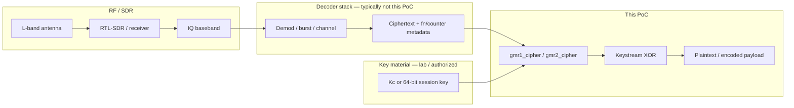

# PoC: GMR-1 & GMR-2 — satphone stream ciphers (GEO-mobile)

This repository contains **keystream generator implementations** for **GMR-1** (Thuraya family / ETSI GMR-1) and **GMR-2+** (Inmarsat family / ETSI GMR-2), plus a small **CLI** and **regression tests**. Both ciphers are classic **stream ciphers**: plaintext/ciphertext is XORed with a keystream; **the same function** performs encryption and decryption.

> **Not** a full RF decoder. This PoC does **not** replace π/4-QPSK demodulation, burst sync, channel coding, interleaving, scrambling, or higher-layer protocol parsing. Those are typically handled by GNU Radio, **Osmocom GMR** (`osmo-gmr`), or dedicated research tooling. This repo provides the **crypto layer** aligned with public references (Osmocom + IEEE S&P 2012).

---

## Quickstart

Generate synthetic artifacts, then decode them with the PoC:

```bash
cd pocs/gmr_satphone_crypto

# Generate example artifacts (GMR-1 bit-level + GMR-2 byte-level)
cd example
python3 generate_examples.py

# Apply PoC to artifacts → plaintext (printed to stdout)
cd ..
python3 integrations/apply_from_decoder_artifacts.py example/gmr1_artifacts.json
python3 integrations/apply_from_decoder_artifacts.py example/gmr2_artifacts.json
```

Optional (regression tests):

```bash
pip install -r requirements-dev.txt
pytest -q tests/
```

---

## Table of contents

1. [End-to-end architecture (intercept → plaintext)](#1-end-to-end-architecture-intercept--plaintext)  
2. [SatDump + RTL-SDR: realistic role & integration](#2-satdump--rtl-sdr-realistic-role--integration)  
3. [Practical integration flow (step by step)](#3-practical-integration-flow-step-by-step)  
4. [Artifacts & offline workflow](#4-artifacts--offline-workflow)  
5. [GMR-1 (A5-GMR-1) — details](#5-gmr-1-a5-gmr-1--details)  
6. [GMR-2 (A5-GMR-2) — details](#6-gmr-2-a5-gmr-2--details)  
7. [Python API (quick reference)](#7-python-api-quick-reference)  
8. [CLI `poc.py`](#8-cli-pocpy)  
9. [Tests & regression vectors](#9-tests--regression-vectors)  
10. [Integration troubleshooting](#10-integration-troubleshooting)  
11. [Example data (synthetic)](#11-example-data-synthetic)  
12. [Legal & ethics](#12-legal--ethics)  
13. [References](#13-references)  
14. [R&D notes: public gaps, hypotheses, next experiments](#14-rd-notes-public-gaps-hypotheses-next-experiments)

---

## 1. End-to-end architecture (intercept → plaintext)



**What you must have before calling the Python modules:**

| Input | GMR-1 | GMR-2 |
|--------|--------|--------|
| **64-bit session key** | `Kc` (8 bytes, from SIM/session setup) | `key` 8 bytes (same role as the session key in the paper) |
| **Frame counter** | `fn` **19-bit effective** (key mixing matches `osmo-gmr`) | **22-bit** counter per key-frame; 15-byte blocks chained with +1 |
| **Encrypted data** | Bits/bytes **after** channel coding + at the exact XOR position in the burst | Byte stream XORed with 15-byte keystream blocks |
| **Optional** | Uplink vs downlink (`keystream_bits_ul`) | `initial_s` 8 bytes if default `pack_frame_to_s` does not match firmware |

Without the correct **Kc/key** and correct **bit/byte alignment** at the cipher boundary, the XOR output will be garbage. That is an integration limitation, not an implementation bug.

---

## 2. SatDump + RTL-SDR: realistic role & integration

### 2.1 What is SatDump in this context?

**SatDump** ([SatDump/SatDump](https://github.com/SatDump/SatDump)) is a **satellite decoding** application (weather, HRPT/LRPT, some L-band pipelines, etc.) with **direct SDR support** and offline baseband processing.

**Important:** at the time of writing, SatDump does **not** provide a ready-made pipeline for **GMR-1/GMR-2 satphone telephony traffic** (Thuraya / Inmarsat IsatPhone) comparable to **Osmocom GMR** for GMR-1. For this specific telephony case, SatDump is typically **not** a replacement for `osmo-gmr`, but a **supporting tool** in a broader signal chain.

### 2.2 Reasonable roles for SatDump + RTL-SDR

| Role | Notes |
|------|-------|
| **IQ recorder** | Save baseband to a file (e.g., WAV 16-bit I/Q, raw, or convert to `.fc32` / SigMF) for **offline** processing in GNU Radio or other tools. |
| **L-band experiments** | If you monitor the same band as the service (use operator docs / a **legal** band plan for your region), raw recordings still require a separate **GMR demod/decoder**. |
| **Not** | SatDump does not automatically produce `Kc`, `fn`, and cipher-aligned ciphertext for this PoC without an additional decode layer. |

**RTL-SDR:** can be sufficient to **receive** narrowband L-band **if** sensitivity, filtering, and **frequency legality** are satisfied. Many GMR-1 research setups use higher-grade receivers (Airspy, etc.), but RTL-SDR remains valid for **recording/prototyping** with realistic expectations (SNR, overload, images).

### 2.3 Connecting SatDump → GMR decoder tools → this PoC

Hybrid integration concept:

1. Record **IQ** with SatDump (or `rtl_sdr`, GQRX, etc.) at the relevant downlink frequency (only if **authorized**).  
2. Convert to a format readable by **GNU Radio Companion** / **gr-osmosdr** (e.g., interleaved complex float32).  
3. For **GMR-1**, a well-established research path is the **Osmocom** stack:
   - `osmo-gmr` — GMR-1 decode stack (bursts, L1, calls to `gmr1_a5` producing 208/658/96-bit keystreams, etc.).  
   - This PoC is equivalent at the cipher core level to `src/l1/a5.c`; you can **replace** or **verify** keystream generation using Python.  
4. Extract from the decode chain (manually or via a patch): a cipher-aligned **ciphertext blob**, the **frame number** used in `gmr1_a5`, and **Kc** (lab/legal only).  
5. Call `gmr1_cipher.encrypt_decrypt` or do bit-level XOR via `keystream_for_channel`.

For **GMR-2**, there is no broadly used `osmo-gmr` equivalent; “real” integration often relies on **firmware/research vectors** plus tuning **`initial_s`** (see [§6](#6-gmr-2-a5-gmr-2--details)).

---

## 3. Practical integration flow (step by step)

### 3.1 Recommended environment

- Python **3.10+**  
- (Optional) `pytest` — see [§9](#9-tests--regression-vectors)  
- For RF: RTL-SDR drivers, SatDump or SDR#, **GNU Radio** if you build an IQ pipeline  
- For GMR-1 reference decoding: clone & build **[osmo-gmr](https://github.com/osmocom/osmo-gmr)** (see that project's README)

### 3.2 Example workflow (GMR-1, high level)

1. **Authorization** — only legal band/location/targets (lab, operator, verified research).  
2. **Record IQ** — SatDump / `rtl_sdr` → baseband file.  
3. **Decode L1** — use `osmo-gmr` (or your tools) until you obtain an **encrypted frame** + **fn** metadata + **Kc** (lab).  
4. **Align bits** — ensure the bit order matches what gets XORed in the stack (downlink vs uplink, 208 vs 658 bits, etc.).  
5. **Python:**

   ```python
   import gmr1_cipher as g1

   kc = bytes.fromhex("...")   # 8 byte
   fn = 0x12345                # 19 bit efektif
   ct = bytes.fromhex("...")   # atau list bit dari decoder

   # Jika byte-aligned dan satu arah DL:
   pt = g1.encrypt_decrypt(ct, kc, fn, uplink=False)
   ```

6. **Verify** — compare the first bytes of keystream against `gmr1_a5` internal logs if you patch Osmocom for debug printing.

### 3.3 Example workflow (GMR-2)

1. Obtain an 8-byte **key** plus the **22-bit counter** used per 15-byte keystream key-frame (protocol analysis / lab).  
2. If bit-exact handset interop fails, capture the initial **8-byte S state** and use `initial_s` **only for the first key-frame**.  
3. Use `gmr2_cipher.encrypt_decrypt` or `keystream_chained` + manual XOR.

### 3.4 Bridge script (once you have decoder artifacts)

If you already have **cipher-aligned** decoder output (ciphertext, key, counter), use this bridge script:

```bash
cd pocs/gmr_satphone_crypto
python3 integrations/apply_from_decoder_artifacts.py artifacts.json
```

Example `artifacts.json` (GMR-1):

```json
{
  "scheme": "gmr1",
  "kc": "0123456789abcdef",
  "fn": "0x1a2b3",
  "uplink": false,
  "ciphertext": "9863edd4"
}
```

Example `artifacts.json` (GMR-2):

```json
{
  "scheme": "gmr2",
  "key": "0123456789abcdef",
  "fn22": 42,
  "direction": false,
  "initial_s": null,
  "ciphertext": "a0cf88c463dc63fa7f0d278b30831312ab"
}
```

The formal schema is in `integrations/schema.json`.

### 3.5 IQ file format (interoperability)

- SatDump often exports/uses **WAV** or raw baseband depending on presets; GNU Radio typically expects conversion to `gr_complex` (float32 I, float32 Q).  
- **SigMF** ([sigmf.org](https://sigmf.org/)) is recommended to document `sample_rate`, `center_freq`, `datetime_utc` for reproducibility.  
- Keep notes on sample rate and frequency offset; GMR demodulators depend on them.

---

## 4. Artifacts & offline workflow

This section explains how to use the PoC **offline** once you have output from a PHY/L1 decoder (e.g., `osmo-gmr` for GMR-1). The focus is the cipher boundary: **ciphertext_bits** + metadata → **plaintext**.

### 4.1 Artifact format

The canonical schema is in `integrations/schema.json`. The format supports:

- **`ciphertext`**: hex bytes aligned at the cipher XOR boundary, or
- **`ciphertext_bits`**: `0/1` bitstring aligned at the cipher XOR boundary (more realistic for L1)
- `channel` + `nbits` (optional but recommended for alignment validation)

### 4.2 Bridge (artifact-in → plaintext-out)

Script:

```bash
python3 integrations/apply_from_decoder_artifacts.py artifacts.json
```

It will:

- generate a keystream (or XOR directly if `keystream_bits` is present),
- print `keystream_head_hex`,
- print plaintext (hex + UTF-8 if valid).

### 4.3 Offline harness (for artifacts from a real decoder)

If artifacts come from a decoder that also exports `keystream_bits` (e.g., the `osmo-gmr` patch below), use:

```bash
python3 integrations/offline_artifact_harness.py /path/to/artifact.json
```

Harness modes:
- **direct XOR**: `ciphertext_bits` XOR `keystream_bits` (no key-schedule assumptions),
- **generated keystream**: uses `kc/fn` and PoC functions for verification.

### 4.4 `osmo-gmr` patch (GMR-1) to export artifacts

This workspace includes a patch to `osmo-gmr/src/gmr1_rx.c` that writes JSON artifacts at the cipher boundary for selected channels:

- `tch3_speech` (208 bit)
- `facch9_mux` / `tch9` (658 bit)

Enable via env var:

```bash
export GMR1_ARTIFACT_DIR=/tmp/gmr1_artifacts
mkdir -p /tmp/gmr1_artifacts
```

Optional: restrict exported channels (comma-separated):

```bash
export GMR1_ARTIFACT_CHANNELS=tch3_speech,facch9_mux
```

Then run your decode pipeline as usual; artifacts will be written as:
`gmr1_<channel>_fn<fn>_tn<tn>_sid<sid>.json`.

#### 4.4.1 Why this patch exists (goal)

The goal is to make the **cipher boundary** visible and testable:

- **Before**: `gmr1_rx.c` calls `gmr1_a5(...)` and then channel decoders (`gmr1_tch3_decode`, `gmr1_tch9_decode`, `gmr1_facch9_decode`) perform the XOR in-place. Without instrumentation, bit/keystream alignment is hard to validate.
- **After**: right after keystream generation (`ciph[]`) and right before further decoding, we dump:
  - **`ciphertext_bits`**: the encrypted bit-field that will be XORed with `ciph[]`
  - **`keystream_bits`**: `ciph[]` as produced by `gmr1_a5`
  - metadata (`fn`, `tn`, `sync_id`, `toa`, `channel`, `nbits`, `kc`)

This lets you:

- do **direct XOR** offline to confirm the boundary is correct,
- or compare `keystream_bits` vs Python PoC output (port verification).

#### 4.4.2 What changed (technical summary)

The patch adds the following helpers and hooks in `gmr1_rx.c`:

- **New helpers**:
  - `gmr1_dump_artifact_json(...)`: writes JSON if `GMR1_ARTIFACT_DIR` is set and the channel is allowed
  - `gmr1_artifact_channel_allowed(...)`: filter via `GMR1_ARTIFACT_CHANNELS`
  - `gmr1_soft_to_ubit(...)`: convert `sbit_t` softbits → `ubit_t` hard decisions for `ciphertext_bits`
  - `gmr1_bits_to_str(...)`: serialize bits to a `0/1` string

- **Hook locations (channels) and exported fields**:
  - **TCH3 speech** (`_rx_tch3_speech`):
    - keystream: `gmr1_a5(..., 208, ciph, NULL)`
    - ciphertext_bits: `bits_xmy[208]` (built from `ebits[0..51]` + `ebits[56..211]` because `ebits[52..55]` are status bits)
  - **FACCH9 / TCH9** (`rx_tch9`):
    - keystream: `gmr1_a5(..., 658, ciph, NULL)`
    - ciphertext_bits: `bits_my[658]` (built from `ebits[0..51]` + `ebits[56..661]`; status bits are `ebits[52..55]`)

Note: `ciphertext_bits` in artifacts are **hard decisions** derived from softbits. For more sensitive work (e.g., reliability analysis), you can extend the format to export softbits as well.

#### 4.4.3 Example artifacts JSON (patch output)

Truncated example for `tch3_speech`:

```json
{
  "scheme": "gmr1",
  "channel": "tch3_speech",
  "nbits": 208,
  "fn": 123456,
  "tn": 3,
  "sync_id": 0,
  "toa": 12.345,
  "uplink": false,
  "kc": "0123456789abcdef",
  "ciphertext_bits": "0101... (208 bits)",
  "keystream_bits": "1110... (208 bits)",
  "timestamp_unix": 1760000000
}
```

Offline decode:

```bash
python3 integrations/offline_artifact_harness.py /tmp/gmr1_artifacts/gmr1_tch3_speech_fn123456_tn3_sid0.json
```

If you want to verify the Python port against artifact keystream:

1. Take `kc`, `fn`, and `ciphertext_bits` from the artifact.
2. Run `integrations/apply_from_decoder_artifacts.py` (generates keystream locally).
3. Compare with `offline_artifact_harness.py` (direct XOR with `keystream_bits`).

### 4.5 Independent cross-check (standalone C, without Osmocom)

To strengthen the integrity of the GMR-1 port, a standalone keystream generator is provided:

```bash
cd integrations
cc -O2 -Wall -Wextra -o osmo_gmr_keystream osmo_gmr1_a5_standalone.c
./osmo_gmr_keystream --kc 0123456789abcdef --fn 0x1a2b3 --nbits 64
```

Compare with Python:

```bash
python3 -c "import gmr1_cipher as g1; print(''.join(map(str,g1.keystream_bits(bytes.fromhex('0123456789abcdef'),0x1a2b3,64))))"
```

---

## 5. GMR-1 (A5-GMR-1) — details

### 5.1 Algorithm provenance

- Reverse-engineered firmware description (IEEE S&P 2012).  
- C reference implementation: **`osmo-gmr/src/l1/a5.c`** (AGPL).  
- This Python module is a **logic port** (LFSRs, clocking, mixing `fn` into internal state, 250-step warm-up, DL/UL handling).

### 5.2 Parameters

- **`kc`**: 8 bytes (64-bit session key as used in SIM/session setup).  
- **`fn`**: integer; **19 bits** are effective for mixing (CLI masks with `0x7FFFF`).  
- **Direction:** downlink uses `keystream_bits` then MSB-first packing; uplink uses `keystream_bits_ul` (skips a GSM-style 114-bit-equivalent block in the reference A5 logic; in Osmocom GMR-1, bit lengths per call follow channel specifics, not always 114).

### 5.3 Channel mapping (consistent with `gmr1_rx.c`)

| `CHANNEL_CIPH_BITS` key | Bits | Osmocom context |
|---------------------------|------|-------------------|
| `tch3_speech` | 208 | TCH3 speech |
| `facch9_mux` | 658 | FACCH9 (path mux) |
| `burst96` | 96 | Potongan per burst |

`keystream_for_channel(kc, fn, "tch3_speech")` returns a **bit list** of the exact length required to XOR against the encrypted field **once** alignment is confirmed.

### 5.4 Bit order

- **`keystream_bits` / `keystream_bits_ul`:** bit *i* is the *i*-th generator output bit.  
- **`keystream_bytes_dl`:** the first 8 bits map to the first byte **MSB-first** (`bits[0]` → bit 7).

---

## 6. GMR-2 (A5-GMR-2) — details

### 6.1 Structure provenance

- **Section V** of Driessen et al. (F, G, H; Table IV; DES S-boxes S2 & S6 with the column/row mapping as specified).  
- **Byte-oriented:** one keystream byte per “clock”; the first **8** bytes after init are discarded; the next **15** bytes form a **key-frame**; the **22-bit** counter increments; re-init.

### 6.2 Constants & chaining

- **`KEYFRAME_BYTES = 15`**  
- **`keystream_chained` / `encrypt_decrypt`:** concatenates multiple key-frames with `fn22` incrementing modulo \(2^{22}\).  
- **`initial_s`:** used only for the **first key-frame**; later frames use **`pack_frame_to_s(fn + k)`** unless you implement custom integration.

### 6.3 Interop limitations

The paper does **not** fully define the exact mapping from **22-bit N** + **direction bit** into the 8-byte **S** register. The default in code is **little-endian packing** of `fn22` into the low bytes plus a `direction`-dependent XOR pattern on `S[7]`. For **device interop**, be prepared to supply **`--s-init`** / `initial_s` from firmware vectors or lab observation.

#### 6.3.1 What is “official” (public) vs what is not published

The ETSI network standard for GMR-2 (03.020) documents the **external interface** for ciphering:

- **COUNT (22-bit)** as an explicit synchronization input derived from the TDMA frame number (T1/T3/T2 concatenation).
- **Direction Bit** (0: Mobile→PSTN, 1: PSTN→Mobile) as an input distinguishing directions.

However, the same document states that the **“internal specification of algorithm GMR-2-A5”** is managed by **GSAC** and is **made available only in response to an appropriate request** (i.e., not part of the public spec). Research implications:

- You can know **which** synchronization inputs exist (COUNT + direction).
- But details required for **bit-exact interop** (including the precise mapping COUNT/direction → internal **S** and other init details) are not publicly available.
- Therefore, the most robust path to 1:1 interop is bringing **lab artifacts**: e.g., measured keystream vectors or `initial_s` for the first key-frame.

### 6.4 Bit-level API

- **`keystream_bits_chained`**, **`iter_keystream_bits_chained`:** MSB-first bits per byte, useful when aligning to bit-oriented processing.

---

## 7. Python API (quick reference)

| Module | Primary functions | Purpose |
|--------|----------------|----------|
| `gmr1_cipher` | `keystream_bits`, `keystream_bytes_dl`, `keystream_bits_ul` | Build DL/UL keystream |
| `gmr1_cipher` | `keystream_for_channel`, `CHANNEL_CIPH_BITS` | Standard channel bit lengths |
| `gmr1_cipher` | `bits_msb_first_to_bytes`, `encrypt_decrypt` | Bit packing / fast XOR |
| `gmr2_cipher` | `keystream_keyframe`, `keystream_chained` | Single / chained key-frames |
| `gmr2_cipher` | `keystream_bits_chained`, `iter_keystream_bits_chained` | Bit output |
| `gmr2_cipher` | `encrypt_decrypt`, `pack_frame_to_s` | Full XOR / default S init |

Import from this directory (or add it to `PYTHONPATH`):

```python
import gmr1_cipher as g1
import gmr2_cipher as g2
```

---

## 8. CLI `poc.py`

```bash
cd pocs/gmr_satphone_crypto

# GMR-1 — Kc hex 16 digit, fn 19-bit
python3 poc.py gmr1 --kc 0123456789abcdef --fn 0x1a2b3 --text "test"
python3 poc.py gmr1 --kc 0123456789abcdef --fn 0x1a2b3 --hex deadbeef

# GMR-2 — key 8 byte, fn22, plaintext hex atau --text
python3 poc.py gmr2 --key 0123456789abcdef --fn 42 --text "Hello"
python3 poc.py gmr2 --key 0123456789abcdef --fn 0x3ffff --hex 00ff00aa

# GMR-2 — override register S awal (16 hex = 8 byte), first key-frame only
python3 poc.py gmr2 --key 0123456789abcdef --fn 5 --hex 0011 \
  --s-init 0102030405060708

# Arah default packing S (flag)
python3 poc.py gmr2 --key 0123456789abcdef --fn 0 --hex 00 --direction
```

---

## 9. Tests & regression vectors

```bash
pip install -r requirements-dev.txt   # pytest
cd pocs/gmr_satphone_crypto
pytest -q tests/
```

`test_vectors.json` stores **stable** keystream outputs to detect regressions. For **cross-verification** with C, build `osmo-gmr` and compare bits from `gmr1_a5(1, kc, fn, nbits, ...)` against `gmr1_cipher.keystream_bits`.

---

## 10. Integration troubleshooting

| Symptom | Likely cause |
|--------|----------------------|
| Random plaintext after XOR | Wrong **Kc** or **fn**; or you XORed data that still includes **scrambling** / **FEC** / wrong burst position. |
| GMR-1 DL vs UL mismatch | Use `uplink=True` only when you are truly on the uplink path and alignment matches the reference behavior. |
| GMR-2 does not match handset | Different **S initialization**; try a trusted **`initial_s`**; re-check 22-bit counter endianness. |
| GMR-2 keystream length | Do not call `keystream()` for >15 bytes; use **`keystream_chained`**. |
| “SatDump doesn’t decode” | Expected for GMR satphones; use **Osmocom** / GNU Radio for GMR-1 PHY/L1. |

## 11. Example data (synthetic)

### 11.1 “More realistic” sample artifacts (bit-level)

The `example/` folder contains synthetic artifacts (not real intercept output) that model L1 structure more closely:

```bash
cd example
python3 generate_examples.py

cd ..
python3 integrations/apply_from_decoder_artifacts.py example/gmr1_artifacts.json
python3 integrations/apply_from_decoder_artifacts.py example/gmr2_artifacts.json
```

See `example/README.md` for details.

### 11.2 “beep → demod → decode” demo (synthetic AFSK)

To understand why digital signals often sound like “beeps” when monitored as audio, there is a safe AFSK demo (not satphone PHY):

```bash
cd example/beep_afsk
python3 make_beep_wav.py --message "hello, 1,2,3" --out hello.wav
python3 demod_decode_wav.py --in hello.wav
```

---

## 12. Legal & ethics

This section is intentionally brief. For lab context and policies, see:
`security-research-lab/ai_agent_instructions/02_LEGAL_CONTEXT.md` dan
`security-research-lab/ai_agent_instructions/08_SAFETY_OVERRIDES.md`.

---

## 13. References

- B. Driessen, R. Hund, C. Willems, C. Paar, T. Holz, *Don't Trust Satellite Phones: A Security Analysis of Two Satphone Standards*, **IEEE Symposium on Security and Privacy**, 2012.  
- ETSI, *TS 101 377-3-10 V1.1.1 (2001-03): GEO-Mobile Radio Interface Specifications; Part 3: Network specifications; Sub-part 10: Security Related Network Functions; GMR-2 03.020* (Annex C: GMR-2-A5 external spec; internal spec “managed under GSAC”).  
- Osmocom GMR-1: [https://github.com/osmocom/osmo-gmr](https://github.com/osmocom/osmo-gmr) (`src/l1/a5.c`, `gmr1_rx.c`).  
- SatDump: [https://github.com/SatDump/SatDump](https://github.com/SatDump/SatDump), documentation at [docs.satdump.org](https://docs.satdump.org/).  
- SigMF: [https://sigmf.org/](https://sigmf.org/)

---

## 14. R&D notes: public gaps, hypotheses, next experiments

This section summarizes the **evidence status** and **experiment agenda** so research work can be replicated.

### 14.0 Threat model & assumptions (PoC scope)

This PoC models the **cipher boundary layer** only. In other words, it assumes you already have:

- **Cipher-aligned ciphertext** (correct bit/byte order + exact field length).
- Correct **key material** (GMR-1: `Kc`; GMR-2: `key` as defined by the paper).
- Correct **counter** (GMR-1: 19-bit-effective `fn`; GMR-2: 22-bit COUNT/`fn22` + `direction`).

Out of scope:

- PHY/L1 reconstruction (demod/bursts/channel coding, deinterleave, descramble).
- Session keying protocols and how to obtain keys from real systems.

### 14.1 Evidence chain (what we treat as “ground truth”)

- **GMR-1 (A5-GMR-1)**:
  - Ground truth implementation: `osmo-gmr/src/l1/a5.c`.
  - The Python PoC targets **bit-faithful** behavior, cross-verified via:
    - test vectors (`test_vectors.json`),
    - standalone C generator (`integrations/osmo_gmr1_a5_standalone.c`),
    - cipher-boundary artifacts from the `gmr1_rx.c` patch (direct XOR vs generated keystream).

- **GMR-2 (A5-GMR-2)**:
  - Primary public ground truth: the reverse-engineering description in the IEEE S&P 2012 paper (F/G/H structure + tables).
  - ETSI defines the **external interface** (22-bit COUNT + Direction Bit) publicly, but the internal spec is GSAC-managed (not open).
  - The Python PoC implements the cipher core per the paper and provides an interop escape hatch via `initial_s`.

### 14.2 Open research questions (blocking 1:1 interop)

- **GMR-2 init state**: the precise mapping \((COUNT,\ direction)\) → 8-byte **S** (and other init details) is not public.
- **GMR-2 PHY/L1**: a demod/burst/channel-coding pipeline that yields cipher-aligned ciphertext + the correct COUNT still requires dedicated research tooling.

### 14.3 Highest-leverage next experiments (lab)

Without going into operational intercept instructions, the relevant gap-closing experiments are:

- **Vector acquisition**:
  - Capture lab artifacts for several consecutive COUNT values: \((key,\ COUNT,\ direction,\ ciphertext,\ plaintext)\) or at least a keystream head.
  - Goal: validate (or correct) `pack_frame_to_s()` and direction handling.

- **Model fitting for S init**:
  - With multiple vectors, test hypotheses for COUNT packing (endianness, bit order, XOR masks, rotations, etc.).
  - Target outcome: a deterministic rule that removes the need for manual `initial_s`.

- **Cipher-boundary logging (like GMR-1)**:
  - If you have your own GMR-2 decoder, export artifacts at the pre-XOR boundary (cipher-aligned ciphertext + counter + direction + key) so this PoC can serve as a “crypto oracle/validator”.

### 14.4 Reproducibility checklist (R&D practice)

This checklist helps keep results *repeatable* and *falsifiable*.

- **Versions & environment**
  - Record Python version and the repo commit hash.
  - Run `pytest -q tests/` and keep the output.

- **GMR-1 (bit-faithful)**
  - Cross-check at least one vector via:
    - Python vs standalone C (`osmo_gmr1_a5_standalone.c`), and/or
    - Python vs artifact `keystream_bits` exported by the `gmr1_rx.c` patch.
  - Record: `kc`, `fn`, `nbits/channel`, and a keystream head (e.g., first 64 bits).

- **GMR-2 (paper-faithful + interop escape hatch)**
  - Verify PoC invariants:
    - 8-byte discard + 15-byte key-frame,
    - chaining increments `fn22` modulo \(2^{22}\).
  - If your goal is 1:1 interop: keep lab artifacts for consecutive COUNT values including `direction` and a keystream head, so init hypotheses can be re-tested.

---

*This README documents technical integration; compliance responsibility remains with the user.*
